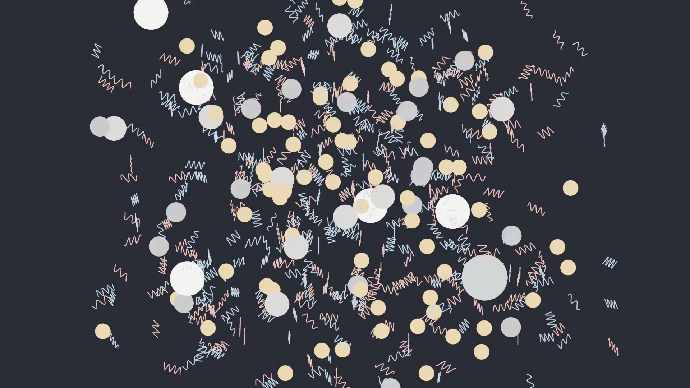

# Vibrasim

A 3D simulated world built from one primitive, the vibration, with frequency, polarity, position, velocity, and nothing else. Out of those, a small set of natural laws makes vibrations bind into electrons, electrons into pairs, pairs and electrons into triads, and a triad plus an electron into an indestructible atom. Atoms then bind into molecules. Molecules can grow into structures that fire, structures that talk to each other, and eventually into a substrate that listens, watches, learns, and talks back. The full conceptual case is in [`docs/CONCEPT.md`](docs/CONCEPT.md).

This isn't a product. It's the substrate that the concept paper proposes, made concrete enough to actually run, and now extended into an explicit agent — the *baby brain* — whose first design is at [`docs/superpowers/specs/2026-05-06-baby-brain-foundation-design.md`](docs/superpowers/specs/2026-05-06-baby-brain-foundation-design.md).


> *Phase 1 climax — t = 13.4 s simulated, the moment a triad absorbs its fourth electron and the first atom (bright sphere, upper-right) locks into place.*



> *Phase 2 climax — t ≈ 5.5 s under the `session-3b` calibration that unlocked molecule formation. Multiple atoms (large white spheres) and the first di-atomic molecule.*

## Two things in one repo

This codebase carries two layers, and reading it is easier if you know which is which.

**The substrate** — the original eight-phase research programme. Vibrations, electrons, atoms, molecules, membranes, neurons, synapses, networks, attention. Local rules only. No top-down structure. The substrate is what the concept paper specifies, and we run it to find out which rules nature actually needed at each level.

**The baby brain** — the agent we are building on top of the substrate. It is multi-modal: it listens via a microphone, watches via a webcam, receives a reward signal, and speaks back through a speaker. It grows physical structure inside itself in response to its own experience. Repeated exposures form persistent structure; one-off coincidences fade. Cross-modal events (showing a glass of water while saying "water") form bridges between the regions that fire together, so that, after enough exposure, presenting one input pattern recalls the other. Nothing about this requires a learning algorithm bolted on top of the substrate. Every claim above reduces to the substrate's local laws.

Where we are right now: the substrate's first three phases (atoms, molecules, partial membranes) reproduce reliably from calibrated configs. As of 2026-05-08 the substrate also fires individual atoms via integrate-and-fire dynamics with refractory windows, and the baby-brain foundation has landed in full. Plans A (substrate growth), A.5 (Numba JIT performance), B (STDP with directional bridges), C (audio I/O), D (video I/O), E (reward + agent loop), and F (speech-loop port-to-port coupling) are all merged on `main`. Suite is 272 non-slow tests + 18 slow tests passing or xfailed with documented reasons. The headline acceptance test (M4 "glass-of-water") is partially demonstrated at component level and partially xfailed at chain composition — see "What runs today" below for the empirical state.

## Quick start

```bash
# Recommended (faster, lockfile-versioned):
uv sync --extra dev --extra dashboard
uv run pytest

# To talk to the substrate with real mic / webcam / speaker, also install
# the `agent` extra (pulls sounddevice + opencv-python-headless):
uv sync --extra dev --extra dashboard --extra agent

# Or with pip:
python3.13 -m venv .venv
source .venv/bin/activate
pip install -e ".[dev,agent]"
```

## Talk to the substrate

After installing the `agent` extra, the live mic + webcam + speaker app is one command:

```bash
# List available audio + video devices (find your --mic, --speaker, --cam indices):
uv run python -m agent.talk --list-devices

# 20-second training pass (show + speak together), then talk-only:
uv run python -m agent.talk

# Tune duration + device indices:
uv run python -m agent.talk --train 30 --mic 1 --speaker 2 --cam 0

# CI / no-hardware mode — synthetic sources:
uv run python -m agent.talk --synthetic
```

Inside the app: pre-seeded atoms in audio + video ports, pre-seeded bridges from video → audio_input, G3 (synaptic_post_search_samples=6) and G6 (bridge atom-to-atom direct propagation) enabled, Plan F speech-loop closing the audio_input → audio_output coupling. Same configuration as `tests/test_agent_m4_minimal_smoke.py`, which passes at cosine ≥ 0.475.

While running, the app prints a per-second status line — substrate node count, atom + bridge counts, vibration count, total firings, and the audio output level in dB. Press Ctrl-C to stop.

Verified on macOS-arm64 (Python 3.13.12) and Linux-x86_64 CI. Numba JIT (Plan A.5) targets the same platforms; Windows is untested.

```bash
# Run the substrate at the calibrated Phase-1 config (atom at t = 13.4s):
python -m world run --duration 60 --snapshot-every 5 \
                    --snapshot-dir snapshots/run-001/ \
                    --config renders/calibration_session3.toml

# Or the Phase-2 config (≥ 5 molecule species in 60 s):
python -m world run --duration 60 --snapshot-every 1 \
                    --snapshot-dir snapshots/run-002/ \
                    --config renders/calibration_phase2_acceptance.toml

# Or the integrate-and-fire test (Phase 4 dynamics, this session's amendment):
pytest tests/test_neuron_dynamics.py -v
```

**Verify the Phase 1 headline (atom at t=13.4s, rng_seed=42):**

```bash
uv run python -m world run --duration 20 --snapshot-every 0.1 \
                            --snapshot-dir snapshots/verify-phase1/ \
                            --config renders/calibration_session3.toml \
                            --seed 42 2>&1 | grep -m1 "atom   1"
```

Expected output: `t =   13.40 | total_v    400 | ambient 5.8594e-04 | vibr   300 | e-   44 | pair   1 | triad   0 | atom   1`

## The research dashboard

A Postgres-backed Streamlit application records every research session, every config, every run, every observation, and every substrate amendment. It also generates natural-language run reports as both Markdown and PDF, and renders the substrate's state in 3D inside the browser with full zoom/rotate/hover.

```bash
docker compose up -d              # Postgres + Streamlit, on :5433 + :8502
# open http://localhost:8502
```

| Page | What it does |
|---|---|
| Dashboard | Programme-level snapshot — sessions, runs, amendments, acceptance |
| Sessions | Each session is one research question and its outcome. Notes attach here. |
| Config | Edit `WorldConfig` snapshots. Save them. Load them. |
| Runs | Register a run, drive the simulator, import observations from snapshots, generate reports |
| Results | Per-run observations, species, **3D viewer with frequency-coloured layers**, generated report (Markdown + PDF) |
| Amendments | Substrate amendments to `CONCEPT.md` and their decision state |
| Acceptance | The §5 acceptance criteria across all eight phases, with evidence pointers |

The 3D viewer auto-fits its axes to the actual data so the cluster fills the canvas regardless of box size. Each entity type is its own toggleable layer in the legend. Hover for frequency, polarity, level, and species fingerprint.

The natural-language report describes the run in prose: setup, chronology of structure formation with timestamps, peak populations, distinct species, the phase reached in CONCEPT.md terms, operator notes, acceptance criteria touched. PDF rendering uses ReportLab, three pages, the same blue/grey/white palette as the dashboard.

## What runs today

**Headline results, reproducible from this checkout:**

- **Phase 1**: first atom forms reproducibly at t = 13.4 s simulated (`renders/calibration_session3.toml`, rng_seed=42, single command in Quick start).
- **Phase 2**: ≥ 5 distinct molecule species in 60 simulated seconds (`renders/calibration_phase2_acceptance.toml`, same seed). Keyframe: `renders/keyframe_first_molecule.png`.
- **Phase 7**: 0.954 carrier-frequency selectivity recovered from synthetic firing histories — independently validates the measurement pipeline (pipeline validation on synthetic data; end-to-end substrate validation is post-Plan-A). (`tools/synthesize_carrier_firing.py` + `tools/measure_attention_selectivity.py`)

The substrate works through Phase 2 and partially Phase 3, plus Phase 4 (integrate-and-fire) and the entire baby-brain foundation. The full test suite is 280 non-slow tests + 18 slow tests, all passing or xfailed with documented reasons.

What runs **today**:

- Phase 1: atoms form reproducibly (calibrated)
- Phase 2: ≥ 5 molecule species, level 5–8 structures (calibrated)
- Phase 3: shell-detection geometry, no spontaneous shells yet
- Phase 4: integrate-and-fire dynamics, refractory works, firing log saved with each snapshot
- Phase 6: 3-neuron chain firing patterns measured per-neuron
- Phase 7: 8 Hz carrier-frequency selectivity recovered with 0.954 selectivity from synthetic firing histories — independently validates the measurement pipeline
- **Plan A (substrate growth)** — recycling regeneration, strength-aware decay for level-5+ structures, molecule + molecule binding, tuned Phase 4 emissions across a frequency band
- **Plan A.5 (Numba JIT performance)** — five inner physics loops JIT-compiled, slot recycling for high-churn loops; per-tick wall cost roughly an order of magnitude lower than pure-Python on bound K. (`bind_vibrations_to_electrons` and `bind_nodes_upward` remain pure-Python because of `allocate_node` side effects — the next perf gap.)
- **Plan B (STDP with directional bridges)** — orientation vectors on bridge molecules, asymmetric LTP/LTD by causal vs anti-causal pair timing, synaptic transmission across bridges
- **Plan C (audio I/O)** — log-mapped tonotopic encoder/decoder, 0.954 selectivity recovered (I2 headline)
- **Plan D (video I/O)** — oriented filter bank + retinotopic XY + orientation-Z encoder, distinct shapes produce distinct port patterns (I4 headline)
- **Plan E (reward + agent loop)** — tristate `k_reward_polarity` field, reward channel, asymmetric STDP swap at firing time, stepped + real-time agent loop
- **Plan F (speech-loop port-to-port coupling)** — engineered audio_input → audio_output ghost-burst at firing frequency, default off, SL1–SL5 unit tests green
- **G1 (JIT bind_vibrations_to_electrons)** — candidate-batch refactor, equivalence test green
- **G3 (synaptic_post_search_samples)** — extends bridge reach along orientation, default 1 (legacy), 3 tests green
- **G4 (encoder emit_pair_band)** — audio/video encoder injects 8 %-paired vibrations under deterministic stimuli, default 0.0 (legacy), 4 tests green

What's currently xfailed with empirical findings on record:

- **M4 (glass-of-water) substrate-bootstrap** — currently xfailed at the original 30 pairs × 4 sim-sec scope (substrate self-bootstrap from input-only stimuli) and at the scoped-down 1 × 1 sim-sec minimal-smoke (cosine = 0.000 measured). The chain composition gap is documented in CONCEPT §10.8: components individually pass, but the four alignment requirements (atom firing + bridge near port + vibration flow + post-atom existence) do not compose at the present substrate's wall-time budget under deterministic stimuli.
- **M5 (reward shaping)** — xfailed for the same chain-composition reason at the original scope.

The full foundation design is in [`docs/superpowers/specs/2026-05-06-baby-brain-foundation-design.md`](docs/superpowers/specs/2026-05-06-baby-brain-foundation-design.md). The Plan F speech-loop spec is in [`docs/superpowers/specs/2026-05-08-plan-F-speech-loop-design.md`](docs/superpowers/specs/2026-05-08-plan-F-speech-loop-design.md). The empirical record of the chain composition under M4 is in [`docs/CONCEPT.md`](docs/CONCEPT.md) §10.8.

## Where to read further

| Document | What's in it |
|---|---|
| [`docs/CONCEPT.md`](docs/CONCEPT.md) | The full conceptual case: motivation, related work, the eight phases with biological reference points, the six testable hypotheses, the ethical questions if it ever reaches the late phases |
| [`docs/Konzeptpapier.de.md`](docs/Konzeptpapier.de.md) | German original of the concept paper |
| [`docs/superpowers/specs/2026-05-06-baby-brain-foundation-design.md`](docs/superpowers/specs/2026-05-06-baby-brain-foundation-design.md) | The foundation spec — what we just designed and approved |
| [`docs/superpowers/specs/2026-05-05-world-of-vibrations-design.md`](docs/superpowers/specs/2026-05-05-world-of-vibrations-design.md) | The Phase-1 design that drove the original build |
| [`docs/superpowers/specs/2026-05-06-phase-{2..7}-*.md`](docs/superpowers/specs/) | Per-phase design specs |
| [`docs/RESEARCH_GUIDE.md`](docs/RESEARCH_GUIDE.md) | A 1000-line continuation guide — fresh clone to research session 5+ |
| [`docs/TUTORIAL.md`](docs/TUTORIAL.md) | Fresh-clone-to-first-calibration walkthrough with failure modes documented honestly |
| [`files/SPECIFICATION.md`](files/SPECIFICATION.md) | The substrate's constitution, translated from the German source |
| [`files/SKILL.md`](files/SKILL.md) | The eight-phase programme in operational form |
| [`LOGBOOK.md`](LOGBOOK.md) | Research diary — every calibration session, every observed outcome |

## Repository layout

```
world/         # The substrate — config, state, spatial hash, physics, renderer, CLI, snapshot
tools/         # Standalone analysis and rendering — classification, detection, construction, measurement
agent/         # (forthcoming, baby-brain foundation) audio I/O, video I/O, reward, agent loop
app/           # Streamlit dashboard — Postgres-backed sessions, configs, runs, reports, 3D viewer
db/            # Schema and seed for the dashboard's Postgres database
docker/        # Streamlit container
tests/         # Pytest suite — 280 non-slow + 18 slow tests across substrate, tools, dashboard, agent
files/         # Source spec documents in English; German originals as *.de.md
docs/          # Concept paper, tutorial, research guide, design specs and plans, logbook
renders/       # Calibrated TOMLs and the keyframe renders / animations
snapshots/     # Per-run snapshot directories (gitignored at the binary level)
```

## Honest expectations

The substrate's claim is falsifiable: a hierarchical, brain-like system can be built from a sparse set of local rules between elementary vibrations, no neuron-by-neuron biophysics, no learned weights. If the substrate produces atoms, molecules, integrate-and-fire neurons, directional synapses, networks, and an agent that listens and learns to associate "water" with a glass, the claim is supported. If it stops at any of those layers, the failure tells us which rules nature actually needed there.

We are partway up that ladder. The lower layers (atoms, molecules, integrate-and-fire) are reproducible. The middle layers (sustained growth, long-term memory, directional plasticity, audio + video I/O, reward, port-to-port coupling) are now built and tested at component level. The chain composition into a substrate-bootstrapped cross-modal association — the full M4 acceptance criterion — is the present empirical ceiling; CONCEPT §10.8 records what was measured and which substrate amendments are candidates for the next iteration. The upper layers (real-time speed, video output, multi-agent) are openly named as later sub-projects.

Two things from doing this so far. Let the world run before you intervene; the interesting behaviour shows up after minutes of simulated time, not seconds. And trust the world more than your own expectations. If it produces something you did not have in mind, that is often the more interesting thing.

## License and attribution

Concept paper © 2026 Michael Kupermann. Codebase MIT. Citations and prior work referenced inline in `docs/CONCEPT.md`.
