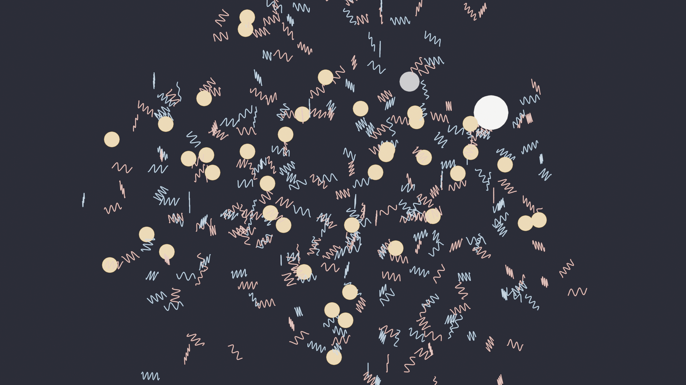

# Vibrasim

A 3D simulated world built from one primitive, the vibration, with frequency, polarity, position, velocity, and nothing else. Out of those, a small set of natural laws makes vibrations bind into electrons, electrons into pairs, pairs and electrons into triads, and a triad plus an electron into an indestructible atom. Atoms then bind into molecules through level 11 (deca-atomic). That's Phases 1 and 2 of an eight-phase research programme. The phases keep going: membrane-like structures, neurons, synapses with molecular transmission, networks, attention, and larger specialised structures. The full conceptual case is in [`docs/CONCEPT.md`](docs/CONCEPT.md).

This isn't a product. It's the substrate that the concept paper proposes, made concrete enough to actually run.



> *The climax frame from `renders/anim_phase1_first_atom.mp4`: the world at t = 13.4 simulated seconds with rng_seed=42, the moment a triad absorbs its fourth electron and the first atom (bright sphere, upper-right) locks into place.*

## Why this exists

The concept paper asks whether a hierarchical, brain-like system can be built from a sparse set of local interaction rules between elementary vibrations, rather than being either biophysically simulated neuron by neuron (NEURON, Blue Brain) or abstracted away from the substrate entirely (deep learning). If yes, you get something neither tradition has. Every property in the model reduces all the way down to the same set of foundational laws, with no level left abstract. If no, you learn something specific about which extra rules nature actually needed at the level the world fell apart.

Phase 1 is the precondition for the rest. Atoms have to form reliably before molecules can, molecules before membranes, membranes before neurons. The interesting work, the synapses with emergent Hebbian plasticity and the networks that recognise patterns, sits at Phase 5 and beyond. We're at Phase 1.

## Running it

```bash
python3.13 -m venv .venv
source .venv/bin/activate
pip install -e ".[dev]"

# Default config (uncalibrated, documentary):
python -m world run --duration 60 --snapshot-every 5 \
                   --snapshot-dir snapshots/run-001/

# Calibrated config that produces an atom at t = 13.4 s simulated:
python -m world run --duration 60 --snapshot-every 1 \
                   --snapshot-dir snapshots/run-002/ \
                   --config renders/calibration_session3.toml

# Live preview (PyVista 3D viewer):
python -m world run --preview --config renders/calibration_session3.toml \
                   --duration 30
```

`Esc` quits. `Space` pauses. `R` reseeds.

For high-quality offline rendering of any snapshot:

```bash
blender -b -P tools/render_blender.py -- \
  --snapshot snapshots/run-002/snapshot_t000060.00.npz \
  --output renders/frame.png \
  --quality medium --engine cycles
```

For an animation from t = 0 to first emergence (atom or whatever level you choose):

```bash
python tools/render_animation.py \
  --config renders/calibration_session3.toml \
  --max-duration 30 --snapshot-stride 6 --stop-at-level 4 \
  --quality low --engine eevee --fps 30 \
  --output renders/my_animation.mp4
```

## What you'll see, what you won't

The defaults in `world/config.py` come straight from the source German spec at [`files/SPEZIFIKATION.de.md`](files/SPEZIFIKATION.de.md). They're documentary, taken from the spec, not calibrated. So a 60-second run at the defaults barely produces electrons and no pairs, which is exactly what the source README said to expect. The first calibration sweep is logged in [`LOGBOOK.md`](LOGBOOK.md).

The **calibrated** config at [`renders/calibration_session3.toml`](renders/calibration_session3.toml) produces an atom at t = 13.4 simulated seconds with rng_seed=42, in an 80³ box with 400 vibrations, `r_2 = 30`, `freq_tolerance = 0.025`. That's the lowest-friction reproducible Phase 1 success criterion this codebase has hit.

Calibration for Phases 2+ (≥5 distinct molecule species, then membrane formation) is open work — the tools are in place; the parameter regions aren't found yet.

## Where to read further

Start with [`docs/CONCEPT.md`](docs/CONCEPT.md) if you want the full conceptual case: motivation, related work, the eight phases with their biological reference points, the six testable hypotheses, and the ethical questions if it ever reaches the late phases. The German original is at [`docs/Konzeptpapier.docx`](docs/Konzeptpapier.docx) (and as plain text at [`docs/Konzeptpapier.de.md`](docs/Konzeptpapier.de.md)).

For the physics specifically, [`files/SPECIFICATION.md`](files/SPECIFICATION.md) is the constitution of the world, translated from the German source. [`files/SKILL.md`](files/SKILL.md) is the same eight-phase programme in operational form. The Phase 1 design doc that drove this build is at [`docs/superpowers/specs/2026-05-05-world-of-vibrations-design.md`](docs/superpowers/specs/2026-05-05-world-of-vibrations-design.md). And there's a step-by-step walkthrough at [`docs/TUTORIAL.md`](docs/TUTORIAL.md), fresh clone to first calibrated run, with the failure modes documented honestly.

## Layout

| Path | What's there |
|---|---|
| `world/` | The package — config, state, spatial hash, physics, renderer, CLI, snapshot |
| `tools/` | Standalone analysis & rendering — `classify_molecules.py`, `detect_membranes.py`, `construct_membrane.py`, `render_blender.py`, `render_animation.py`, `histogram.py`, `sweep.py` |
| `tests/` | Pytest suite — 84 tests covering Phases 1 and 2 plus Phase 3 detection geometry |
| `files/` | Source spec documents in English, German originals preserved as `*.de.md` |
| `docs/CONCEPT.md` | English concept paper, the full eight-phase programme (v2 incorporates peer-review feedback) |
| `docs/TUTORIAL.md` | Fresh-clone-to-first-calibration walkthrough |
| `docs/superpowers/specs/` | Design specs for Phases 1, 2, and 3 |
| `docs/superpowers/plans/` | Implementation plans for Phases 1 and 2 |
| `renders/calibration_session3.toml` | The atom-producing calibration |
| `renders/anim_phase1_first_atom.mp4` | 4.5-second animation of the first-atom emergence at calibrated settings |
| `renders/keyframe_first_atom.png` | The climax frame as a still image |
| `LOGBOOK.md` | Research diary — every calibration session, all observed outcomes |

## Honest expectations

The concept paper gives realistic timelines: weeks for Phase 1, months for molecules and membranes, a year or more for neurons, and Phase 5 (synapses with plasticity) is openly named as the most likely point of failure. There's no guarantee any given phase is reached. Each phase that is reached is a result on its own, and that's true even of a well-documented failure, which would tell us specifically which extra rules were missing.

But two things from doing it. Let the world run before you intervene; the interesting behaviour shows up after minutes, not seconds. And trust the world more than your own expectations. If it produces something you didn't have in mind, that's often the more interesting thing.
