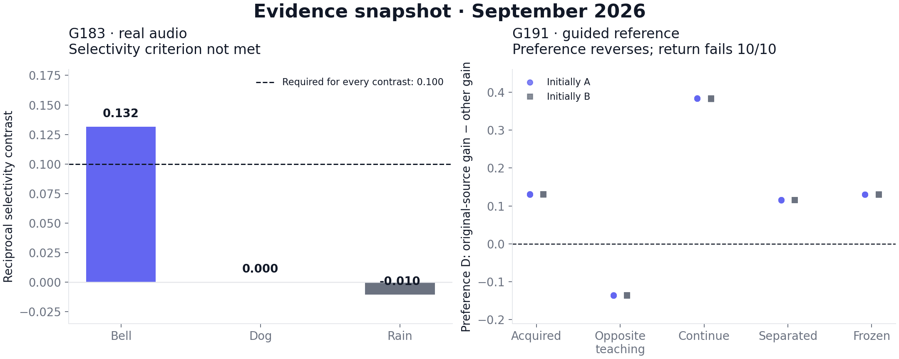
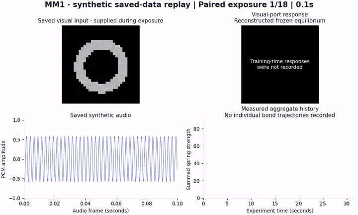
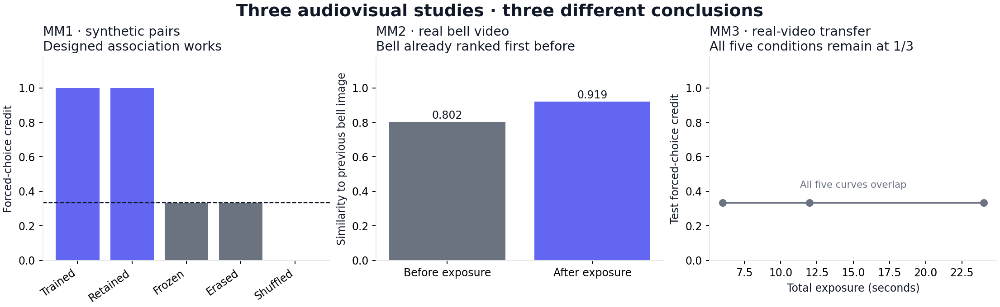
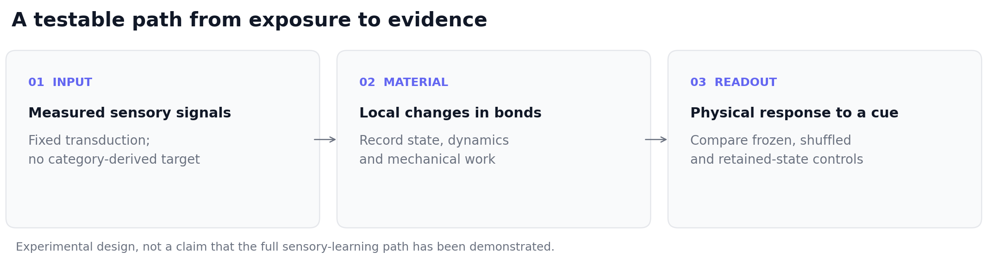

# VibraSim

Research software for studying memory and learning in simulated physical systems.

## Why VibraSim exists

VibraSim asks whether experience can become part of a material: whether sound,
images and eventually text can change local bonds so that later cues produce
useful responses from the same physical system. The aim is to make storage,
adaptation and recall consequences of material dynamics, with measurable energy
costs and persistence.

The underlying idea is that a learning system's structure should carry its
history. Sensory input perturbs the substrate; local interactions change it;
those changes influence what happens the next time a signal arrives. The research
question is whether this can grow beyond simple memory into associations that
remain useful on new experiences, without a classifier supplying the answers.

This motivates the bottom-up approach: investigate the intermediate steps from
interacting elements and bonds to persistent memory, selective responses and
continued learning. Engineered sensors and boundary conditions are stated
explicitly. The behavior attributed to learning must be measured in the substrate.

**Current evidence:** controlled fixtures show local memory and finite changes in
mechanical input preference. The tested real-audio and audiovisual transfer tasks
have not demonstrated reliable recognition. Autonomous multimodal learning remains
an open research objective.



*Left: only one of three required audio-selectivity contrasts clears its threshold.
Right: mechanical preference reverses in a guided reference model; its separate
return-to-rest requirement fails at every endpoint. These are different experiments
and do not form a combined learning score.*

## Learning from sound and video

The audiovisual experiments make the idea concrete: expose the system to paired
images and sound, retain the resulting spring state, then present sound alone
and inspect the unforced visual response. The image shown to a viewer during an
audio-only test is a reference; it is not supplied to the learner.

[](docs/research/2026-09/audiovisual-replay.mp4)

[Watch the replay with sound](docs/research/2026-09/audiovisual-replay.mp4).
This is a replay of saved **synthetic** inputs and measured aggregate spring
history from MM1, followed by a reconstructed frozen-equilibrium readout from the
saved final state. It is not a recording of individual bonds forming or a new
training run. The full 18-second exposure, 5-second hold and nine audio-only
probes are represented. The animation is silent; the linked MP4 includes audio.



- **Synthetic audio–image association (MM1):** the engineered spring fixture
  associated three shapes with three tones. Trained and retained conditions scored
  9/9; frozen and erased controls received chance credit. This establishes the
  designed association mechanism on that task.
- **Bell video (MM2):** a separate bell Short was tested against saved memory.
  Similarity to the previous bell image increased from 0.802 to 0.919, but that
  image already ranked first before exposure. This is a diagnostic observation,
  not proof of recognizing bells. [Source video](https://www.youtube.com/shorts/DLTbO3b6eLM)
- **Transfer between real recordings (MM3):** six training recordings and three
  test recordings did not produce useful scene retrieval. All conditions remained
  at 1/3. The small, confounded dataset also limits the conclusion.

The positive synthetic result and the negative real-video result answer different
questions. Repeated video playback can change the instrument's springs; reliable
learning from real video has not yet been demonstrated.
[Video-experiment methods and replay provenance](docs/research/2026-09/REPORT.md#audiovisual-experiments-and-replay)

## What is implemented

| Component | Purpose | Scope |
|---|---|---|
| [World simulator](world/) | Evolve interacting elements, bonds and material state | A rule-based research substrate; its “atoms” and “molecules” are model abstractions, not validated atomic physics |
| [Audiovisual reference code](docs/research/2026-09/reference-source/vibrasim2/) | Study fixed sensory encodings and engineered associations | Archived implementation snapshots; separate from the installed World simulator |
| [Guided mechanical references](docs/research/2026-09/REPORT.md#guided-reference-models) | Isolate local stiffness adaptation, transfer and numerical effects | Constrained numerical models; they have not replaced the production simulator |



The distinction between these components matters. A result in a small, externally
driven spring fixture is evidence about that fixture, not evidence of a brain,
consciousness, language understanding or unrestricted learning.

## Selected results

Evidence snapshot: **12 September 2026**. Verdicts apply to the registered question
and model, rather than to the project as a whole.

| Study | Result | Interpretation |
|---|---|---|
| G183 — real-audio selectivity | **NULL** | Bell contrast 0.132, dog 0.000, rain −0.010; all three had to reach 0.100 |
| MM3 — audiovisual scene transfer | **NULL** | All five evaluated conditions scored 1/3 on three test recordings at every checkpoint |
| G189 — timing-dependent mechanical transfer | **Mixed** | Transfer depends on exposure timing; the return criterion fails in all seven conditions |
| G191 — finite source-preference reassignment | **Scoped positive finding** | Preference reverses in both tested directions; return fails at all ten endpoints, and acquisition was measured on a sibling state copy |

[Methods, measurements, corrections and evidence files →](docs/research/2026-09/REPORT.md)

These results do not establish continued learning over long periods, robust
recognition across recordings, spontaneous functional specialization, or learning
by repeatedly playing a video. Visible motion and changing bonds are observations;
a learning claim additionally requires a discriminating task and controls.

## Research method

Each confirmatory experiment specifies a question, prediction, comparison and
acceptance criteria before execution. Reports distinguish experimental validity,
prediction accuracy and contribution to the research objective. A valid experiment
can have a negative result; an accurate prediction of failure does not satisfy a
missing capability.

The record includes unsuccessful hypotheses and implementation errors. In the
recent series, a snapshot-decoding error invalidated the first G185 analysis, and
G186's first design was withdrawn before execution because its proposed boundary
intervention did not change the condition. Numerical traversal sensitivity and
residual motion also required explicit diagnosis. These corrections are described
in the [research report](docs/research/2026-09/REPORT.md#corrections-and-numerical-limitations).

Known methods are treated as prior work. Local material memory, directed aging and
physical learning networks predate this project. The current experiments do not
establish scientific novelty. [Prior work and reuse](docs/research/2026-09/REPORT.md#prior-work)

## Run the simulator

Requires Python 3.13 or later and [uv](https://docs.astral.sh/uv/).

```sh
git clone https://github.com/mkupermann/vibrasim.git
cd vibrasim
uv sync --locked --extra dev
uv run python -m world --help
```

For interactive inspection:

```sh
uv run python -m world gui
```

The viewer requires a graphical environment. Running it demonstrates simulation
behavior; it does not reproduce the findings listed above. The evidence package
contains saved measurements from separate experimental revisions.

To verify the published file checksums and regenerate the README figures:

```sh
uv run python tools/render_research_overview.py --verify
uv run python tools/render_research_overview.py
```

These commands inspect saved evidence and render figures. They do not rerun a
learning experiment. See the report for the limits of this evidence release.

## Repository guide

- [Research report and evidence index](docs/research/2026-09/REPORT.md) — current findings and their limits.
- [World source](world/) and [tests](tests/) — simulator implementation and software checks.
- [Concept document](docs/CONCEPT.md) — historical model rationale and terminology.
- [Experiment history](LOGBOOK.md) and [programme record](FRONTIER.md) — detailed development history; older programme statements are not current capability claims.

VibraSim is an experimental research codebase. Its useful output is a testable
model and an auditable record of its capabilities and limitations.
